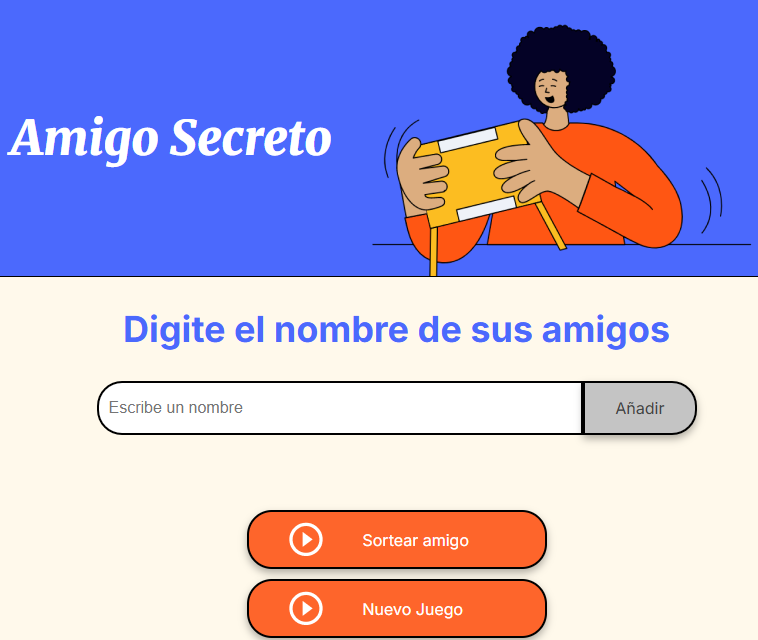

<h1 align=" center"> CHALLENGE AMIGO SECRETO </h1> 

Una simple aplicación web para sortear amigos secretos. Introduce los nombres de tus amigos, haz clic en sortear y ¡que comience la diversión!

## Índice
- [Funcionalidades](#funcionalidades)
- [Tecnologías Usadas](#tecnologías-usadas)
- [Cómo Usar](#cómo-usar)
- [Vista Previa](#vista-previa)
- [Créditos](#créditos)
- [Licencia](#licencia)

## 🛠️ Funcionalidades
- **Añadir nombres:** Los usuarios pueden agregar nombres de amigos a una lista.
- **Validación:** El programa verifica que el campo de entrada no esté vacío antes de añadir un nombre.
- **Sorteo aleatorio:** Con el botón "Sortear Amigo" se selecciona un nombre de la lista de forma aleatoria para determinar al amigo secreto.
- **Reiniciar juego:** El botón "Nuevo Juego" permite borrar la lista y empezar de nuevo.
- **Interfaz sencilla:** Un diseño limpio y fácil de usar para una experiencia fluida.

## Tecnologías Usadas
- **HTML:** Para la estructura de la página web.
- **CSS:** Para el estilo y diseño.
- **JavaScript:** Para toda la lógica y funcionalidad del sorteo.

## Cómo Usar
1.  **Abre el archivo `index.html`:**
    Simplemente abre el archivo `index.html` en tu navegador web. No se requiere servidor.
2.  **Añade nombres:**
    Escribe los nombres de tus amigos en el campo de texto y haz clic en "Añadir".
3.  **Sortea:**
    Una vez que todos los nombres estén en la lista, haz clic en el botón "Sortear Amigo".
4.  **Reinicia:**
    Si quieres hacer un nuevo sorteo, haz clic en "Nuevo Juego".

## Vista Previa

